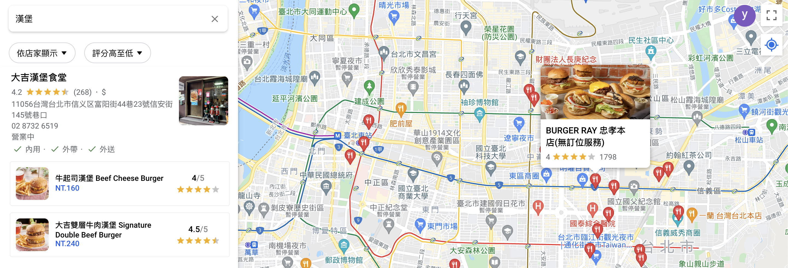

    <h1 align="center">Map Plus</h1>
  

  Google Map Redesign  
   Solve the problem that Google Map cannot able to search for menu items.
     
    <a href="https://map-780c3.web.app/"><strong>View Website »</strong></a>
     
  

<kbd>
    

</kbd>

 
 

# Technologies

### Front-End Basic

- HTML
- CSS
- JavaScript (ES6)
- Responsive Web Design (RWD)

### Front-End Frameworks & Libray

- React
- Redux
- styled-components
- react-hot-toast

### Firebase Services

- Authentication
- Cloud Storage
- Cloud Firestore
- Hosting

### Third party Servies

- Google Maps JavaScript API
- Google Maps Place API
- Algolia

### Tool for Development

- Node Package Manager (NPM)
- ESLint
- Prettier

 

## Features

---

### Search Filter

<kbd>

</kbd>

 
 

### Collect & Creat collection List Element

<kbd>

</kbd>

 
 

### Comment element

<kbd>

</kbd>

 
 

### Check favorites

<kbd>

</kbd>

 
 

### User current postion check

<kbd>

</kbd>

 
 

### Store Preview

<kbd>

</kbd>

 
 

## Mobile Demo

---

<kbd>
    
</kbd>

 
 
 
 

## Contact

---

Feel free to contact me if you have any questions. 
E-mail: jessylee2208@gmail.com
